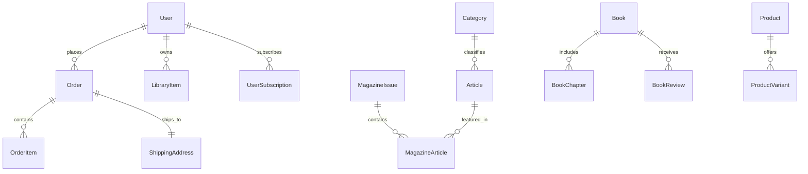

# Notes From a B.Tech Brain — Publications & E-Commerce Platform

> *"Turn things worth reading into things worth keeping."*

An editorial publication platform and independent digital bookstore built with **Next.js 16**, **TypeScript**, **Tailwind CSS**, **Prisma ORM**, and **Neon PostgreSQL**.

Designed and developed by **Zainab Shujat** during an e-commerce web development internship, exploring how an independent technical blog can evolve into a full-scale publishing press and bookstore.

---

## 📌 Project Overview & Disclaimer

- **Authentic Content:** Essay archives and articles are sourced directly from the live publication at [btechbrain.zainabshujat.dev](https://btechbrain.zainabshujat.dev) and [zainabshujat.dev](https://zainabshujat.dev).
- **Demonstration E-Commerce Layer:** Books, monthly magazine issues, prices, reviews, customer orders, and physical fulfillment are **placeholder/demo models** designed to demonstrate full-stack e-commerce architecture, cart state management, checkout workflows, database normalization, and reader library fulfillment.

---

## ✨ Features

### 📖 1. Editorial Archive & Essay Reader
- Clean, typography-first reading experience with serif headlines (*Playfair Display*), clean sans-serif body (*Inter*), and code blocks (*JetBrains Mono*).
- Dynamic category filtering, estimated reading times, publication metadata, and bookmarking.
- Responsive reading layouts optimized for long-form technical study.

### 📚 2. Periodical Magazine Issues
- Structured monthly volumes with linked Table of Contents (TOC) join records.
- Multi-format purchase options (Digital PDF/ePub, Softcover Print, Annual Collections).
- DRM-free direct download generation for verified reader accounts.

### 🏛️ 3. Bookstore & Monographs
- Bound volume showcase with chapter breakdowns, sample excerpts, and editorial reviews.
- Multi-variant product models (Digital Edition, Softcover, Foil-stamped Hardcover) with SKU and inventory tracking.

### 🛒 4. E-Commerce Engine & Reader Checkout
- Dynamic slide-over Cart Drawer with real-time subtotal calculation and local storage persistence.
- Checkout flow supporting:
  - Form validation with address capture
  - Simulated payment authorization or live Stripe integration
  - Instant digital entitlement generation upon order confirmation
  - Order reference generation (`NBB-YYYY-XXXX`)

### 👤 5. Reader Account & Digital Library
- Entitlement management: purchased issues and monographs automatically appear in the reader's **Digital Library**.
- Reading progress tracking and signed download handlers.
- Subscription tier management (Monthly Reader & Annual Patron).

### 📊 6. Publisher Desk (Admin Dashboard)
- Overview of gross revenue, active subscribers, and publication volume metrics.
- Content catalog and order management tables.

---

## 🛠️ Technology Stack

| Layer | Technology |
|---|---|
| **Framework** | [Next.js 16 (App Router)](https://nextjs.org/) + React 19 Server Components |
| **Language** | [TypeScript](https://www.typescriptlang.org/) |
| **Styling** | [Tailwind CSS](https://tailwindcss.com/) with bespoke editorial design tokens |
| **Database** | [Neon PostgreSQL](https://neon.tech/) (Serverless) |
| **ORM** | [Prisma v6](https://www.prisma.io/) |
| **Icons & Typography** | [Lucide React](https://lucide.dev/), Google Fonts (*Playfair Display*, *Inter*, *JetBrains Mono*) |
| **Payments** | Stripe API & Webhook listeners (with instant demo checkout fallback) |

---

## 🗄️ Database Architecture

The data layer uses a normalized schema with 15 relational models:



### Key Models:
- **`Article` & `Category`**: Core publication writing with tags, reading metrics, and editorial roles.
- **`MagazineIssue` & `MagazineArticle`**: Periodicals with explicit join tables linking articles to page numbers.
- **`Book`, `BookChapter`, `BookReview`**: Long-form monographs with structured chapters and reader reviews.
- **`Product` & `ProductVariant`**: E-commerce entities supporting `DIGITAL`, `PRINT`, and `BUNDLE` formats with SKU and inventory tracking.
- **`Order`, `OrderItem`, `ShippingAddress`**: Complete transactional checkout records.
- **`LibraryItem`**: Digital access entitlement connecting customers directly to downloadable files.

---

## 🚀 Getting Started

### 1. Clone the Repository
```bash
git clone https://github.com/ZainabShujat/Btech-Brain-Publications.git
cd Btech-Brain-Publications
```

### 2. Install Dependencies
```bash
npm install
```

### 3. Configure Environment Variables
Create a `.env` file in the root directory:

```env
# Neon PostgreSQL Connection String
DATABASE_URL="postgresql://<user>:<password>@<host>/<database>?sslmode=require"

# Application URL
NEXT_PUBLIC_APP_URL="http://localhost:3000"

# Authentication (Development)
NEXTAUTH_SECRET="your-development-secret-key"
NEXTAUTH_URL="http://localhost:3000"

# Optional Stripe Integration
# STRIPE_SECRET_KEY="sk_test_..."
# NEXT_PUBLIC_STRIPE_PUBLISHABLE_KEY="pk_test_..."
# STRIPE_WEBHOOK_SECRET="whsec_..."
```

### 4. Push Schema & Seed Database
```bash
# Push Prisma schema to your PostgreSQL database
npx prisma db push

# Populate with authentic essays, demo magazines, books, products, and library items
npx tsx prisma/seed.ts
```

### 5. Run the Development Server
```bash
npm run dev
```

Open [http://localhost:3000](http://localhost:3000) with your browser to view the platform.

### 6. Production Build
```bash
npm run build
npm start
```

---

## 📂 Project Structure

```
├── prisma/
│   ├── schema.prisma        # Normalized PostgreSQL schema
│   └── seed.ts              # Database seeder (articles, books, issues, products)
├── public/
│   ├── images/covers/       # Magazine and book cover art
│   └── downloads/samples/   # Sample downloadable PDFs
├── src/
│   ├── app/
│   │   ├── (auth)/          # Reader authentication pages
│   │   ├── about/           # Colophon, manifesto & author statement
│   │   ├── account/         # User library, orders, and subscriptions
│   │   ├── admin/           # Publisher Desk metrics & inventory management
│   │   ├── api/             # Checkout, library download, progress & webhook routes
│   │   ├── articles/        # Essay archive and reader pages
│   │   ├── books/           # Bookstore catalog and monograph details
│   │   ├── cart/            # Bag summary page
│   │   ├── checkout/        # Payment & fulfillment flow
│   │   ├── magazines/       # Periodical archive & issue details
│   │   └── subscribe/       # Patron membership tiers
│   ├── components/
│   │   ├── articles/        # Article cards, grids, and filters
│   │   ├── books/           # Book cards, reviews, and format selector
│   │   ├── commerce/        # Cart drawer, quantity selectors, checkout forms
│   │   ├── layout/          # Header, footer, container, and demo banners
│   │   ├── magazines/       # Issue cards and table of contents
│   │   └── ui/              # Buttons, badges, and modals
│   ├── context/
│   │   ├── AuthContext.tsx  # Reader session management
│   │   └── CartContext.tsx  # Cart state & localStorage sync
│   ├── data/                # Seed definitions and fallback data structures
│   ├── hooks/               # Custom cart & auth hooks
│   └── lib/
│       ├── constants.ts     # Site metadata, navigation, and subscription plans
│       ├── prisma.ts        # PrismaClient singleton
│       ├── services/        # Service-layer abstraction (DB query + memory fallback)
│       ├── types.ts         # TypeScript interfaces & domain types
│       └── utils.ts         # Price, date, and string helpers
└── README.md
```

---

## ✍️ Colophon & Credits

- **Editor & Developer:** [Zainab Shujat](https://zainabshujat.dev)
- **Publication:** [Notes From a B.Tech Brain](https://btechbrain.zainabshujat.dev)
- **Inquiries:** [zainabshujatali@gmail.com](mailto:zainabshujatali@gmail.com)
- **GitHub:** [@ZainabShujat](https://github.com/ZainabShujat)
- **LinkedIn:** [Zainab Shujat](https://www.linkedin.com/in/zainab-shujat-web-developer)

---

## 📄 License

This project is open source and available under the [MIT License](LICENSE).
